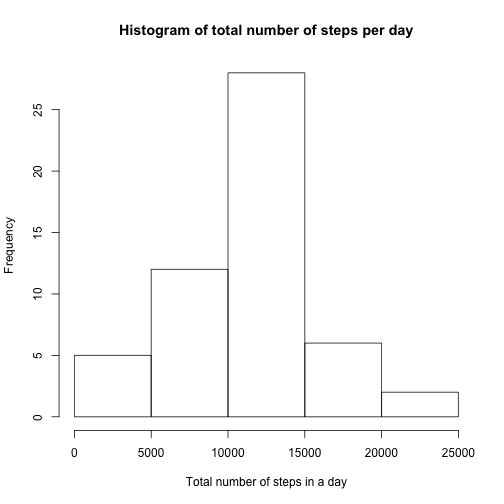
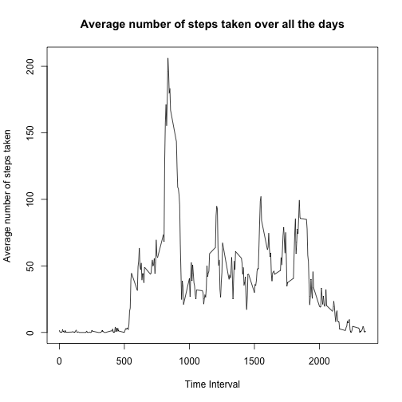
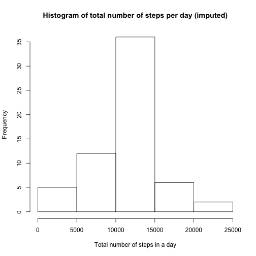
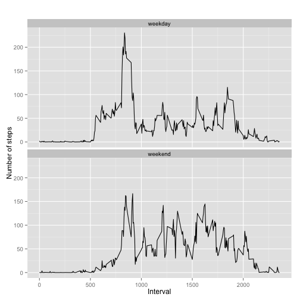

This is the R markdown file created for the Coursera course Reproducible Research, Peer assessment asignment number 1.

load necessary libraries

```r
library(knitr)
library(dplyr)
```

```
## 
## Attaching package: 'dplyr'
## 
## The following object is masked from 'package:stats':
## 
##     filter
## 
## The following objects are masked from 'package:base':
## 
##     intersect, setdiff, setequal, union
```

```r
library(ggplot2)
```


load the activity data

```r
activity <- read.csv("/Users/abasu/Documents/Reproducible Research/activity.csv")
```


taking out the NA's in the data set

```r
activity_na <- na.omit(activity)
```


mean total number of steps taken per day

```r
by_day <- group_by(activity_na, date)
steps_by_day <- summarise(by_day, total = sum(steps))
hist(steps_by_day$total, main="Histogram of total number of steps per day", xlab="Total number of steps in a day")
```

 

```r
mean_total <- mean(steps_by_day$total)
median_total <- median(steps_by_day$total)
```

mean total

```r
mean_total
```

```
## [1] 10766.19
```

median total

```r
median_total
```

```
## [1] 10765
```


average daily activity pattern

```r
steps_by_interval <- aggregate(steps ~ interval, activity_na, mean)
plot(steps_by_interval$interval, steps_by_interval$steps, type='l', 
     main="Average number of steps taken over all the days", xlab="Time Interval", 
     ylab="Average number of steps taken")
```

 

```r
max_steps_row <- which.max(steps_by_interval$steps)
```

The 5-minute interval, on average across all the days in the dataset, contains the maximum number of steps.

```r
steps_by_interval[max_steps_row, ]
```

```
##     interval    steps
## 104      835 206.1698
```

imputing missing values

```r
na.sum <- sum(is.na(activity))
```

total number of missing values in the dataset

```r
na.sum
```

```
## [1] 2304
```


```r
activity_imputed <- activity
for (i in 1:nrow(activity_imputed)) {
  if (is.na(activity_imputed$steps[i])) {
    interval_value <- activity_imputed$interval[i]
    steps_value <- steps_by_interval[
      steps_by_interval$interval == interval_value,]
    activity_imputed$steps[i] <- steps_value$steps
  }
}
imputed_steps_by_day <- aggregate(steps ~ date, activity_imputed, sum)
hist(imputed_steps_by_day$steps, main="Histogram of total number of steps per day (imputed)", 
     xlab="Total number of steps in a day")
```

 

```r
mean_imputed <- mean(imputed_steps_by_day$steps)
median_imputed <- median(imputed_steps_by_day$steps)
```

mean total number of steps taken per day

```r
mean_imputed
```

```
## [1] 10766.19
```

median total number of steps taken per day

```r
median_imputed
```

```
## [1] 10766.19
```


activity patterns between weekdays and weekends

```r
activity_imputed['type_of_day'] <- weekdays(as.Date(activity_imputed$date))
activity_imputed$type_of_day[activity_imputed$type_of_day  %in% c('Saturday','Sunday') ] <- "weekend"
activity_imputed$type_of_day[activity_imputed$type_of_day != "weekend"] <- "weekday"
activity_imputed$type_of_day <- as.factor(activity_imputed$type_of_day)
imputed_steps_by_interval <- aggregate(steps ~ interval + type_of_day, activity_imputed, mean)
qplot(interval, steps, data = imputed_steps_by_interval, type = 'l', geom=c("line"),xlab = "Interval", ylab = "Number of steps", main = "") + facet_wrap(~ type_of_day, ncol = 1)
```

 


